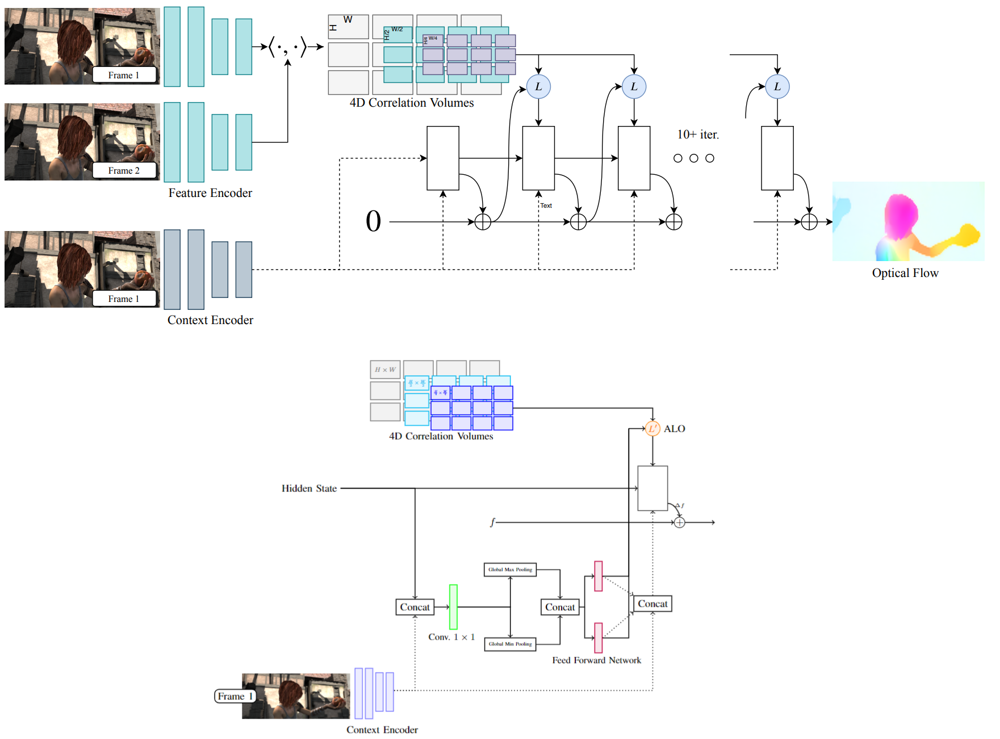
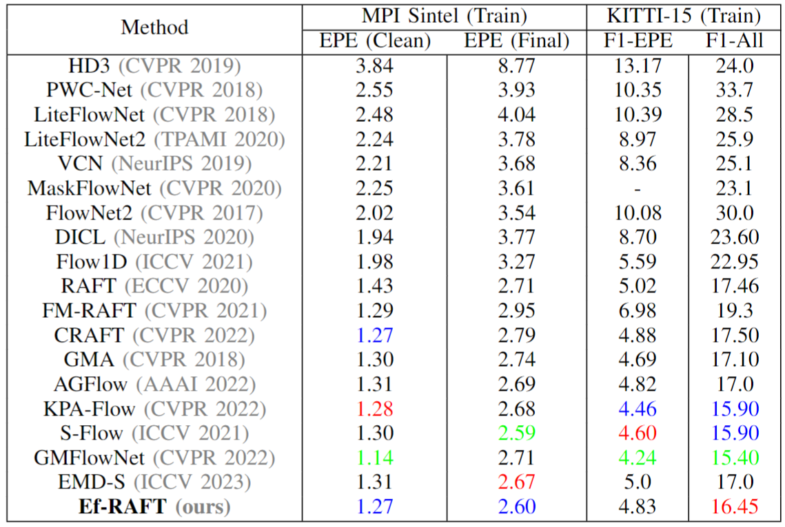
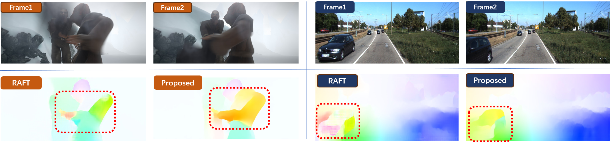

# Ef-RAFT
 	
[](https://paperswithcode.com/sota/optical-flow-estimation-on-sintel-clean?p=rethinking-raft-for-efficient-optical-flow)


 	
[](https://paperswithcode.com/sota/optical-flow-estimation-on-kitti-2015-train?p=rethinking-raft-for-efficient-optical-flow)

 	
[](https://paperswithcode.com/sota/optical-flow-estimation-on-sintel-final?p=rethinking-raft-for-efficient-optical-flow)

This repository contains the source code for [Ef-RAFT: Rethinking RAFT for Efficient Optical Flow](https://arxiv.org/abs/2401.00833)<br/>



## Requirements
The code has been tested with PyTorch 1.6 and Cuda 10.1.
```Shell
conda create --name efraft
conda activate raft
conda install pytorch=1.6.0 torchvision=0.7.0 cudatoolkit=10.1 matplotlib tensorboard scipy opencv -c pytorch
```


## Required Data
To evaluate/train RAFT, you will need to download the required datasets and put them in ```datasets/``` directory. 
* [FlyingChairs](https://lmb.informatik.uni-freiburg.de/resources/datasets/FlyingChairs.en.html#flyingchairs)
* [FlyingThings3D](https://lmb.informatik.uni-freiburg.de/resources/datasets/SceneFlowDatasets.en.html)
* [Sintel](http://sintel.is.tue.mpg.de/)
* [KITTI](http://www.cvlibs.net/datasets/kitti/eval_scene_flow.php?benchmark=flow)

## How to run?
For training on the 2 GPUs run code below. Training logs will be written to the `runs` which can be visualized using tensorboard
```Shell
./train_standard.sh
```

For runing on a signle RTX GPU, training can be accelerated using mixed precision. You can expect similiar results in this setting (1 GPU)
```Shell
./train_mixed.sh
```

You can evaluate a trained model using `evaluate.py`
```Shell
python evaluate.py --model=models/raft-things.pth --dataset=sintel --mixed_precision
```

### Quantitative Results
Comparison of the proposed method with existing
techniques on the Sintel and KITTI datasets. Gree, blue, and
red colors denote the first, second, and third-best results.
<p align="center">

<p/>


### Qualitative Results
Qualitative comparison between the proposed method and RAFT. Frames with orange and blue labels are from Sintel
and KITTI datasets, respectively.



 ## Citation
If you use this repository for your research or wish to refer to our method, please use the following BibTeX entry:
```bibtex
@misc{eslami2024rethinking,
      title={Rethinking RAFT for Efficient Optical Flow}, 
      author={Navid Eslami and Farnoosh Arefi and Amir M. Mansourian and Shohreh Kasaei},
      year={2024},
      eprint={2401.00833},
      archivePrefix={arXiv},
      primaryClass={cs.CV}
}
```

### Acknowledgement
This codebase is heavily borrowed from [RAFT: Recurrent All Pairs Field Transforms for Optical Flow](https://github.com/princeton-vl/RAFT). Thanks for their excellent work.

